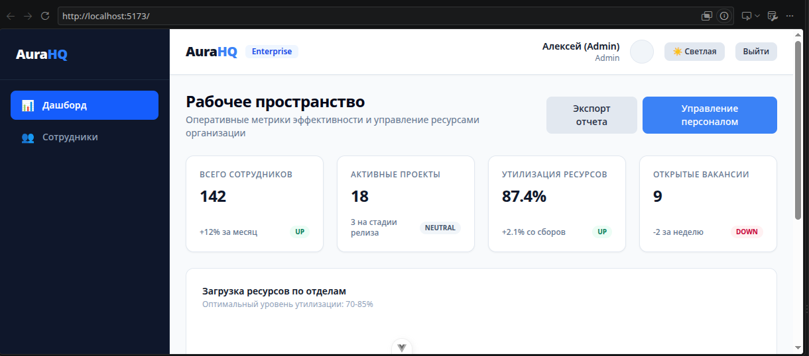
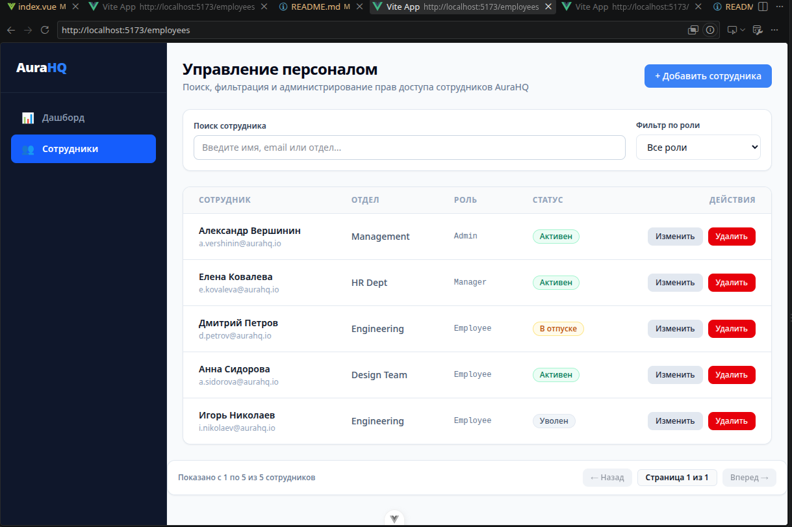
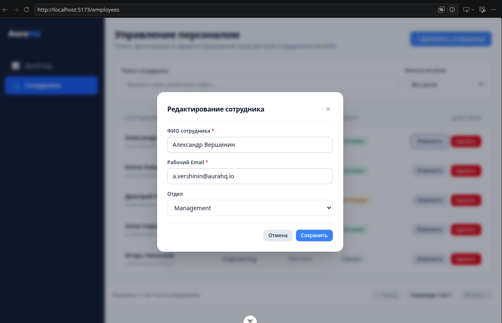

# AuraHQ — готовый пример Enterprise-архитектуры Vue 3 для HR-систем

**AuraHQ** — учебно-практический пример клиентского приложения для управления сотрудниками, ролями и операционными показателями компании.

Проект будет полезен разработчикам, которые хотят увидеть, **как организовать большой Vue 3 + TypeScript проект так, чтобы его было проще развивать, тестировать и масштабировать**.

Здесь можно не просто посмотреть интерфейс, а разобрать готовые инженерные решения: Feature-Sliced Design, RBAC, Pinia, защищённую работу с API, обновление токенов, MSW, тестирование, доступность и систему тем.

---

## 🎯 Что можно получить из этого проекта

Изучая AuraHQ, можно использовать проект как практический reference для собственных Vue-приложений.

### Для архитектуры

Можно посмотреть, как разделить приложение на независимые уровни:

* `app` — запуск и конфигурация приложения;
* `pages` — страницы;
* `widgets` — крупные UI-блоки;
* `features` — пользовательские сценарии;
* `entities` — бизнес-сущности;
* `shared` — переиспользуемая инфраструктура.

Такой подход помогает не превращать Vue-приложение в набор компонентов, связанных между собой случайными импортами.

### Для работы с авторизацией

В проекте показана реализация **Role-Based Access Control (RBAC)**.

Можно посмотреть, как:

* ограничивать доступ к маршрутам;
* разделять возможности администратора и сотрудника;
* организовывать navigation guards;
* связывать роли пользователя с доступными разделами приложения.

Это можно использовать как основу для административных панелей, CRM, ERP, SaaS и внутренних корпоративных систем.

### Для работы с API и токенами

Отдельный интерес представляет сетевой слой на базе Axios.

При истечении `accessToken` проект использует механизм очереди запросов:

1. обнаруживается ошибка авторизации;
2. параллельные запросы временно ожидают;
3. выполняется один запрос на обновление токена;
4. новая сессия сохраняется;
5. ожидающие запросы продолжаются автоматически.

Это позволяет изучить подход к обработке конкурентных запросов при обновлении авторизации.

### Для управления состоянием

Pinia используется через Setup Stores.

Проект показывает, как отделять состояние приложения от компонентов и не превращать страницы в монолитную бизнес-логику.

### Для разработки без реального backend

**Mock Service Worker (MSW)** позволяет запускать приложение локально без полноценного API-сервера.

Благодаря этому можно:

* клонировать проект;
* установить зависимости;
* запустить приложение;
* проверить сценарии авторизации и работы с сотрудниками;
* изучать frontend-архитектуру без настройки отдельного backend.

---

## 🧩 Что здесь можно изучить на практике

Проект особенно полезен как reference при разработке:

* корпоративных админ-панелей;
* HR-систем;
* CRM;
* ERP-интерфейсов;
* SaaS-приложений;
* систем с несколькими ролями пользователей;
* больших Vue SPA.

Вместо абстрактных примеров здесь собраны взаимосвязанные части реального frontend-приложения: авторизация, маршрутизация, состояние, API, CRUD, таблицы, темы, UI-компоненты и тестирование.

---

## 🏗️ Архитектура Feature-Sliced Design

```text
src/
├── app/                  # Инициализация приложения
│   ├── router/           # Маршрутизация и guards
│   ├── stores/           # Глобальное состояние
│   └── styles/           # Глобальные стили
│
├── pages/                # Полноценные страницы
│   ├── Dashboard/
│   ├── Employees/
│   ├── Login/
│   └── Error/
│
├── widgets/              # Крупные блоки интерфейса
│   ├── Sidebar/
│   ├── Header/
│   └── Analytics/
│
├── features/             # Пользовательские действия
│   ├── AddEmployee/
│   ├── EditEmployee/
│   └── DeleteEmployee/
│
├── entities/             # Бизнес-сущности
│   ├── User/
│   └── Employee/
│
└── shared/               # Переиспользуемая инфраструктура
    ├── api/              # Axios и API
    ├── lib/              # Composables и helpers
    └── ui/               # Базовые UI-компоненты
```

Такое разделение позволяет увидеть на конкретном проекте, **куда помещать новый код при дальнейшем развитии приложения**.

---

## 🛠️ Технологический стек

| Технология                 | Для чего используется               |
| -------------------------- | ----------------------------------- |
| **Vue 3**                  | Компонентная архитектура приложения |
| **Composition API**        | Организация логики компонентов      |
| **TypeScript Strict Mode** | Типобезопасность                    |
| **Pinia**                  | Управление состоянием               |
| **Vue Router 4**           | Маршрутизация и RBAC guards         |
| **Tailwind CSS v4**        | UI и адаптивная стилизация          |
| **Axios**                  | HTTP-клиент                         |
| **MSW v2**                 | Имитация backend API                |
| **Vitest**                 | Unit-тестирование                   |
| **Playwright**             | E2E-сценарии                        |
| **ESLint + Prettier**      | Контроль качества и форматирование  |
| **Husky + lint-staged**    | Проверки перед коммитом             |

Структура репозитория также содержит отдельные каталоги `doc`, `e2e`, `public`, `src`, конфигурацию Vitest, Playwright и инструменты контроля качества.

---

## 🔐 Инженерные решения

### RBAC

Маршруты защищаются декларативно через navigation guards.

Это позволяет централизованно контролировать доступ к административным разделам и не дублировать проверки ролей внутри каждого компонента.

### Очередь запросов при обновлении токена

Axios interceptor обрабатывает ситуацию, когда несколько запросов одновременно получают ошибку авторизации.

Вместо запуска нескольких параллельных refresh-запросов используется единый процесс обновления с последующим повтором ожидающих запросов.

### Темизация через CSS Variables

Dark Mode построен на семантических CSS-переменных.

Переключение темы не требует дублирования большого количества Tailwind-классов:

```css
html[data-theme="dark"] {
  /* значения темы */
}
```

Это позволяет централизованно управлять цветовой системой интерфейса.

### Accessibility

Базовые UI-компоненты учитывают требования доступности:

* `aria-invalid`;
* `role="dialog"`;
* управление фокусом;
* закрытие модальных окон через `Escape`;
* клавиатурная навигация.

---

## 🖥️ Что можно посмотреть в интерфейсе

### Аналитический Dashboard

Главная страница демонстрирует корпоративный dashboard с KPI и визуализацией операционных показателей.

Можно посмотреть, как организовать:

* адаптивную сетку;
* аналитические карточки;
* SVG-графики;
* переключение Light / Dark Mode;
* композицию крупных UI-блоков.



### Управление сотрудниками

Раздел `/employees` показывает рабочий CRUD-интерфейс.

Здесь можно изучить:

* таблицу сотрудников;
* пагинацию;
* фильтрацию;
* добавление записей;
* редактирование;
* удаление;
* изоляцию пользовательских сценариев по feature-слоям.





---

## 🚀 Быстрый запуск

### 1. Клонировать проект

```bash
git clone https://github.com/useful-code-lab/vuejs-typescript-fsd-pinia.git
cd vuejs-typescript-fsd-pinia
```

### 2. Установить зависимости

```bash
npm install
```

### 3. Запустить development server

```bash
npm run dev
```

После запуска приложение будет доступно на:

```text
http://localhost:5173/
```

MSW используется для имитации API и позволяет работать с приложением без отдельного backend-сервера.

### 4. Запустить Unit-тесты

```bash
npm run test:unit
```

### 5. Проверить качество кода

```bash
npm run lint
```

---

## 🔑 Тестовая авторизация

Для проверки административного сценария:

```text
Логин:    admin@aurahq.io
Пароль:   123456
```

Страница авторизации:

```text
/login
```

---

## 📌 Для кого этот проект

Проект может быть полезен:

* **Frontend-разработчикам** — как reference для Vue 3 + TypeScript;
* **разработчикам уровня Middle/Senior** — для изучения архитектурных решений;
* **изучающим FSD** — как пример разделения приложения на слои;
* **разработчикам SaaS/CRM/ERP** — как основа для организации frontend-части;
* **техническим лидерам** — как пример структуры масштабируемого SPA;
* **тем, кто готовится к собеседованиям** — для разбора реальных frontend-задач и архитектурных решений.

---

## 💡 Главная ценность проекта

AuraHQ — это не просто демонстрация Vue-компонентов.

Это **готовый пример того, как можно организовать frontend большого приложения**, когда появляются роли пользователей, авторизация, API, глобальное состояние, CRUD-сценарии, тестирование, темы и требования к качеству кода.

Проект можно использовать как отправную точку для собственного приложения или как reference при принятии архитектурных решений.

---

## 📚 Что можно взять для собственного проекта

После изучения проекта можно перенести в собственную разработку отдельные подходы:

* структуру Feature-Sliced Design;
* разделение pages / widgets / features / entities / shared;
* RBAC через route guards;
* Axios interceptors с очередью refresh-запросов;
* Pinia Setup Stores;
* MSW для локальной разработки;
* Tailwind CSS v4 с CSS Variables;
* базовые accessible-компоненты;
* Unit и E2E тестирование;
* автоматические проверки качества кода.

---

## 📄 Лицензия

Проект предназначен для изучения архитектурных подходов и практик разработки современных Vue-приложений.
